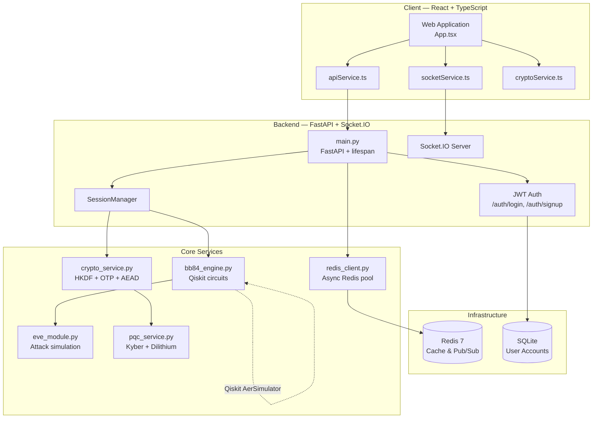

# 🔐 Cryptex — BB84 Quantum Key Distribution System

A full-stack simulation of the **BB84 quantum key distribution protocol** built with FastAPI, React (TypeScript), Socket.IO, Redis, and Docker. Cryptex lets multiple users exchange cryptographic keys using quantum mechanics principles and then communicate through end-to-end encrypted chat and file transfer — with a live eavesdropper simulation built right in.

---

## 📋 Table of Contents

- [Overview](#-overview)
- [System Architecture](#-system-architecture)
- [Technology Stack](#-technology-stack)
- [Project Structure](#-project-structure)
- [Backend — Services & API](#-backend--services--api)
- [Frontend — UI & Components](#-frontend--ui--components)
- [Docker & Infrastructure](#-docker--infrastructure)
- [Installation & Running](#-installation--running)
- [Environment Variables](#-environment-variables)
- [Security Model](#-security-model)
- [Testing](#-testing)
- [Acknowledgments](#-acknowledgments)

---

## 🎯 Overview

Cryptex simulates the full lifecycle of quantum-secured communication:

1. **Authentication** — users register/login with JWT-secured accounts stored in SQLite
2. **Session creation** — generate a unique session ID and invite participants
3. **Role assignment** — join as **Alice** (sender), **Bob** (receiver), or **Eve** (eavesdropper)
4. **BB84 key exchange** — run the BB84 protocol via Qiskit quantum circuit simulation
5. **Hybrid PQC** — optionally combine the BB84 key with a Kyber512 post-quantum key
6. **Encrypted communication** — exchange OTP-encrypted chat messages and XChaCha20-Poly1305 encrypted files
7. **Attack simulation** — Eve can intercept qubits with configurable strategies; QBER monitoring detects intrusions in real-time

---

## 🏗️ System Architecture



### Component Responsibilities

| Layer | Component | Responsibility |
|-------|-----------|---------------|
| Frontend | `App.tsx` | Root state, responsive layout (mobile / tablet / desktop), auth gate |
| Frontend | `socketService` | Socket.IO event emitter/listener wrapper |
| Frontend | `apiService` | Axios HTTP client with JWT header injection |
| Frontend | `cryptoService` | Client-side key storage, QBER history, health scoring |
| Backend | `main.py` | FastAPI app, lifespan (DB + Redis init), all REST routes, Socket.IO handlers |
| Backend | `SessionManager` | In-memory session registry, participant management, timeout cleanup |
| Backend | `BB84Engine` | Qiskit-based qubit generation, transmission, sifting, QBER, privacy amplification |
| Backend | `CryptoService` | HKDF-SHA256, OTP + HMAC-SHA3-256, XChaCha20-Poly1305, hybrid key derivation |
| Backend | `EveModule` | Intercept-resend, depolarising noise, qubit-loss simulation |
| Backend | `PQCService` | Kyber512 KEM, Dilithium2 + SPHINCS+ signatures |
| Backend | `redis_client` | Global async Redis pool with graceful fallback |
| Infra | Redis 7-alpine | Caching, future pub/sub for multi-worker scaling |
| Infra | SQLite + SQLAlchemy | User account persistence |

---

## 🛠️ Technology Stack

### Backend

| Package | Version | Purpose |
|---------|---------|---------|
| Python | 3.11 (Docker), 3.10+ (local) | Runtime |
| FastAPI | 0.104.1 | REST API framework |
| Uvicorn | 0.24.0 | ASGI server |
| python-socketio | 5.9.0 `[asyncio_client]` | Socket.IO server |
| python-multipart | 0.0.6 | File upload support |
| Pydantic | 2.4.2 | Request/response validation |
| Qiskit | ≥ 1.1.0 | Quantum circuit simulation |
| Qiskit-Aer | ≥ 0.14.0 | High-performance quantum simulator backend |
| NumPy | ≥ 1.24.0, < 2.0 | Numerical operations |
| cryptography | 41.0.7 | HKDF, HMAC, AES primitives |
| PyNaCl | 1.5.0 | XChaCha20-Poly1305 (libsodium bindings) |
| pqcrypto | ≥ 0.3.4 | Pure-Python PQC fallback (Kyber, Dilithium) |
| liboqs-python | optional | Native C PQC algorithms (auto-detected at startup) |
| SQLAlchemy | 2.0.36 | ORM for SQLite |
| python-jose | 3.3.0 `[cryptography]` | JWT generation and validation |
| passlib | 1.7.4 `[bcrypt]` | Password hashing |
| bcrypt | 4.0.1 | Bcrypt backend |
| redis | ≥ 5.0.0 `[hiredis]` | Async Redis client |
| python-dotenv | 1.0.0 | `.env` file loading |

### Frontend

| Package | Purpose |
|---------|---------|
| React 18 | UI framework |
| TypeScript | Type-safe development |
| Vite | Build tool and dev server |
| Tailwind CSS | Utility-first CSS (design system base) |
| Custom CSS (`index.css`) | Glassmorphism, animations, design tokens |
| Socket.IO Client | Real-time bidirectional events |
| Axios | HTTP REST client |
| libsodium-wrappers | Client-side cryptographic operations |
| Recharts | QBER line charts, crypto stats pie charts |
| Lucide React | Icon set |
| Inter + JetBrains Mono | Typography (Google Fonts) |

### Databases & Caching

| Technology | Version | Role | Details |
|------------|---------|------|---------|
| **SQLite** | (built-in) | Primary database | Stores user accounts (username, bcrypt-hashed password). Managed via SQLAlchemy ORM. File lives at `backend/data/app.db`. Created automatically on first startup via `DBBase.metadata.create_all()`. |
| **Redis** | 7-alpine | Cache / future message broker | Initialized on backend startup via `redis_client.py`. Uses `redis.asyncio` with a connection pool (max 20 connections) and hiredis C-parser. Persistence enabled with `--appendonly yes` so data survives container restarts. Connected via `REDIS_URL=redis://redis:6379/0`. Gracefully skipped if unreachable (local dev without Docker). |

> **SQLite vs Redis responsibilities:**
> - SQLite = **durable user data** (accounts, passwords). Accessed via SQLAlchemy `scoped_session`.  
> - Redis = **ephemeral fast storage** (caching results, future real-time pub/sub for multi-worker Socket.IO scaling). Accessed anywhere via `get_redis()` from `redis_client.py`.

### Infrastructure (Docker)

| Service | Image | Host Port → Container Port | Purpose |
|---------|-------|---------------------------|---------|
| Redis | `redis:7-alpine` | `6379:6379` | Key-value cache with AOF persistence |
| Backend | `python:3.11-slim` | `8000:8000` | FastAPI + Uvicorn ASGI server |
| Frontend | `node:20-alpine` → `nginx:alpine` | `3000:80` | Vite production build served by nginx |
| SQLite | (file in container) | — | Embedded DB, no separate container needed |

---

## 📁 Project Structure

```
bb84-qkd-system/
│
├── docker-compose.yml          # 3-service stack: redis + backend + frontend
│
├── backend/
│   ├── Dockerfile              # python:3.11-slim, installs requirements.txt
│   ├── requirements.txt        # All Python dependencies
│   ├── test_runner.py          # Comprehensive test suite (12 KB)
│   ├── comparison_tests.py     # BB84 vs traditional crypto benchmarks (10 KB)
│   └── app/
│       ├── main.py             # FastAPI entry point, all routes & Socket.IO events (40 KB, 982 lines)
│       ├── db.py               # SQLAlchemy engine + SessionLocal for SQLite
│       ├── redis_client.py     # Global async Redis pool (init_redis, get_redis, close_redis)
│       ├── models/
│       │   ├── session.py      # Session, User, BB84Data, CryptoSession, Message (44 KB)
│       │   └── user.py         # SQLAlchemy DBUser model for authentication
│       ├── services/
│       │   ├── bb84_engine.py      # BB84 protocol with Qiskit circuits (13 KB)
│       │   ├── crypto_service.py   # HKDF, OTP, XChaCha20, hybrid keys (24 KB)
│       │   ├── eve_module.py       # Attack simulation with Qiskit (12 KB)
│       │   ├── pqc_service.py      # Kyber/Dilithium/SPHINCS+ (26 KB)
│       │   ├── pqc_config.py       # PQC algorithm configuration (9 KB)
│       │   └── session_manager.py  # Session registry and lifecycle (9 KB)
│       ├── routes/             # Additional route modules
│       ├── schemas/            # Pydantic schema definitions
│       └── utils/              # Utility helpers
│
├── frontend/
│   ├── Dockerfile              # Multi-stage: node:20-alpine build → nginx:alpine serve
│   ├── nginx.conf              # nginx SPA routing config
│   ├── package.json
│   ├── vite.config.ts
│   ├── tailwind.config.js
│   └── src/
│       ├── main.tsx            # React root with ThemeProvider
│       ├── App.tsx             # Root component (1211 lines) — auth gate, layout switching
│       ├── index.css           # Full design system CSS (1331 lines)
│       ├── context/
│       │   └── ThemeContext.tsx    # Light/Dark theme provider
│       ├── hooks/
│       │   ├── useBreakpoint.ts    # Mobile/tablet/desktop booleans
│       │   └── useMediaQuery.ts    # Generic CSS media query hook
│       ├── types/
│       │   └── index.ts            # All TypeScript interfaces (User, Session, BB84Progress, …)
│       ├── services/
│       │   ├── apiService.ts       # Axios HTTP client, JWT management (17 KB)
│       │   ├── socketService.ts    # Socket.IO event wrappers (6 KB)
│       │   └── cryptoService.ts    # Client-side key store, health scoring (15 KB)
│       └── components/
│           ├── AuthPage.tsx            # Login / Signup form
│           ├── SessionManager.tsx      # Create / join QKD sessions
│           ├── BB84Simulator.tsx       # Protocol visualizer + controls
│           ├── ChatInterface.tsx       # Encrypted messaging UI
│           ├── FileTransferModule.tsx  # Drag-and-drop file transfer
│           ├── EveControlPanel.tsx     # Attack configurator (Eve role)
│           ├── SecurityDashboard.tsx   # Charts, health score, violations
│           ├── CryptoMonitor.tsx       # Live crypto stats
│           ├── KeyStatusPanel.tsx      # Key material status + preview
│           ├── SessionControlPanel.tsx # Session ID + participant badges
│           ├── StatusBar.tsx           # Compact top-of-session status strip
│           ├── QBERAlertModal.tsx      # Fullscreen eavesdrop alert
│           ├── ThemeToggle.tsx         # Light/Dark switch
│           └── CollapsibleSection.tsx  # Generic expand/collapse wrapper
│
├── UI_DOCUMENTATION.md         # Full UI & design system reference
├── summary.md                  # Project summary
└── README.md                   # This file
```

---

## 🔧 Backend — Services & API

### REST API Endpoints (`main.py`)

#### Authentication
| Method | Path | Description |
|--------|------|-------------|
| `POST` | `/auth/signup` | Create new user account |
| `POST` | `/auth/login` | Login, returns JWT access token |

#### Sessions
| Method | Path | Description |
|--------|------|-------------|
| `POST` | `/api/sessions` | Create new QKD session |
| `POST` | `/api/sessions/{id}/join` | Join session as Alice / Bob / Eve |
| `GET` | `/api/sessions/{id}` | Get session state |
| `GET` | `/api/sessions/{id}/security` | Get crypto info, QBER, health score |
| `GET` | `/api/sessions/{id}/key` | Retrieve derived session key (hex) |
| `DELETE` | `/api/sessions/{id}` | Terminate session |

#### BB84
| Method | Path | Description |
|--------|------|-------------|
| `POST` | `/api/sessions/{id}/bb84/start` | Start BB84 simulation (`n_bits`, `test_fraction`, `use_hybrid`) |

#### Encrypted Communication
| Method | Path | Description |
|--------|------|-------------|
| `POST` | `/api/sessions/{id}/files/upload` | Upload + encrypt file (XChaCha20-Poly1305) |
| `GET` | `/api/sessions/{id}/files/{msg_id}/download` | Download + decrypt file |
| `GET` | `/api/sessions/{id}/files/{msg_id}/raw` | Download raw encrypted bytes |

#### Post-Quantum Cryptography
| Method | Path | Description |
|--------|------|-------------|
| `GET` | `/api/pqc/info` | Available PQC algorithms and active mode |
| `POST` | `/api/pqc/kyber/encapsulate` | KEM encapsulation |
| `POST` | `/api/pqc/dilithium/sign` | Sign a message |
| `POST` | `/api/pqc/dilithium/verify` | Verify a signature |

#### Misc
| Method | Path | Description |
|--------|------|-------------|
| `GET` | `/health` | Server health check |
| `GET` | `/health/redis` | Redis connectivity check |
| `GET` | `/docs` | Interactive Swagger UI |

---

### Socket.IO Events

#### Client → Server
| Event | Payload | Description |
|-------|---------|-------------|
| `join_session` | `{session_id, user_id}` | Join Socket.IO room |
| `send_encrypted_message` | `{session_id, user_id, content}` | Send OTP-encrypted message |
| `request_decrypt` | `{session_id, message_id, user_id}` | Request server-side decryption |
| `eve_control` | `{session_id, attack_type, attack_params}` | Update Eve attack parameters |
| `leave_session` | `{session_id}` | Leave room |

#### Server → Client
| Event | Payload | Description |
|-------|---------|-------------|
| `bb84_started` | `{n_bits, hybrid_mode}` | Protocol started |
| `bb84_progress` | `{stage, progress, qber, threshold, …}` | Live progress updates |
| `bb84_complete` | `{success, key_length, hybrid_mode, crypto_info}` | Protocol finished |
| `bb84_error` | `{error}` | Protocol failure |
| `pqc_key_generated` | `{key_length, algorithm, …}` | Kyber key ready |
| `encrypted_message` | `{message_id, sender_id, encrypted_payload, …}` | New message received |
| `message_decrypted` | `{message_id, decrypted_content}` | Decryption result |
| `encrypted_file` | `{message_id, filename, file_size, …}` | File received |
| `eve_status_update` | `{attack_type, params}` | Eve config changed |
| `eve_detected` | `{qber, threshold}` | QBER exceeded threshold |
| `user_joined` | `{role, user_id}` | Participant connected |
| `user_disconnected` | `{role}` | Participant left |
| `session_terminated` | `{}` | Session ended |
| `security_violation` | `{violation, severity, timestamp}` | Security event |

---

### BB84 Protocol (bb84_engine.py)

The engine uses **Qiskit** (`AerSimulator`) to simulate qubit operations:

1. **Preparation** — Alice generates random bits and random bases (rectilinear `+` or diagonal `×`)
2. **Transmission** — Qiskit circuits encode each bit in the chosen basis; Eve optionally intercepts
3. **Measurement** — Bob measures each qubit in a randomly chosen basis
4. **Sifting** — Only bits where Alice and Bob chose the same basis are kept
5. **QBER Estimation** — A test fraction of sifted bits are compared; error rate > 11% aborts
6. **Privacy Amplification** — SHA-256 hashing compresses remaining bits into the final key
7. **Key Derivation** — `CryptoService.derive_keys()` applies HKDF-SHA256 to produce sub-keys for OTP, HMAC, and file AEAD

**Eve attack modes in EveModule:**

| Strategy | Effect on QBER |
|----------|---------------|
| Intercept-Resend | ~25% error (info-theoretic maximum) |
| Partial Intercept | Proportional to intercept fraction |
| Depolarizing Noise | Controlled noise probability |
| Qubit Loss | Channel transmission loss |

---

### Cryptographic Algorithms (crypto_service.py)

| Operation | Algorithm |
|-----------|-----------|
| Key derivation | HKDF-SHA256 (from `cryptography` library) |
| Message encryption | One-Time Pad (XOR with key stream) |
| Message authentication | HMAC-SHA3-256 |
| File encryption | XChaCha20-Poly1305 (via PyNaCl / libsodium) |
| Hybrid key | BB84 key ⊕ Kyber shared secret → HKDF |
| Password hashing | bcrypt (passlib) |
| JWT tokens | HS256 (python-jose) |

---

### Post-Quantum Cryptography (pqc_service.py)

| Algorithm | Type | Standard |
|-----------|------|---------|
| Kyber512 | KEM | NIST PQC Round 3 |
| Dilithium2 | Digital Signature | NIST PQC Round 3 |
| SPHINCS+ | Hash-based Signature | NIST PQC Round 3 |

- Tries to use **liboqs** (C native bindings) first for performance
- Falls back to **pqcrypto** (pure Python) if liboqs is unavailable
- Fallback to demo implementations for dev/test without PQC libraries

---

## 🎨 Frontend — UI & Components

### Design System

The UI uses an **iOS-inspired glassmorphism** design language:

| Token | Light | Dark |
|-------|-------|------|
| Background | `#F2F2F7` | `#000000` |
| Card surface | `rgba(255,255,255,0.72)` | `rgba(30,30,30,0.65)` |
| Alice accent | `#32ADE6` (cyan) | same |
| Bob accent | `#5856D6` (indigo) | same |
| Eve accent | `#FF3B30` (red) | same |
| Success | `#34C759` | same |
| Warning | `#FF9500` | same |

- **Typography**: Inter (body) + JetBrains Mono (key material, code)
- **Cards**: `.glass-card` — `backdrop-filter: blur(20px)`, 24 px radius, inner shadow
- **Glow borders**: `.glow-border` — cyan/blue gradient pseudo-element
- **Animations**: qubit stream shimmer, particle float, QBER ring, typing indicator

### Responsive Layouts

| Breakpoint | Layout |
|------------|--------|
| Mobile < 768px | Single-column stacked; CollapsibleSection hides secondary panels |
| Tablet 768–1023px | Two-column grid; SessionControlPanel hidden |
| Desktop ≥ 1024px | Full multi-column: BB84 + KeyStatus, Chat + Files + EvePanel, Security Insights |

### Component Summary

| Component | Purpose |
|-----------|---------|
| `AuthPage` | Login / signup with tab toggle, password reveal, inline errors |
| `SessionManager` | Create session or join by ID, select Alice / Bob / Eve role |
| `BB84Simulator` | Protocol stage display, qubit stream animation, QBER ring gauge, start/retry controls |
| `KeyStatusPanel` | Key length + live QBER metrics, blurred key hex preview, progress shimmer bar |
| `ChatInterface` | Role-colored message bubbles, ciphertext preview, decrypt button, file attachment |
| `FileTransferModule` | Drag-and-drop upload, upload progress bar, transfer history with decrypt/raw download |
| `EveControlPanel` | Attack type selector, parameter sliders, start/stop, activity log |
| `CryptoMonitor` | Encryption status badge, message/file counters, key age, violation count, recommendations |
| `SecurityDashboard` | Health score, risk level, QBER line chart, crypto pie chart, violations list |
| `SessionControlPanel` | Session ID with copy, connection + security pills, participants list |
| `StatusBar` | Compact strip: user role, session ID, participant count, BB84 progress, eve alert |
| `QBERAlertModal` | Fullscreen breach alert with QBER vs threshold, abort/analyze actions |
| `ThemeToggle` | Light/Dark switch (Sun/Moon), compact mode for mobile |
| `CollapsibleSection` | Generic expandable card with chevron animate |

---

## 🐳 Docker & Infrastructure

### Services (docker-compose.yml)

```
┌─────────────────────────────────────────────────────┐
│  Host                                                │
│  localhost:3000 ──► frontend (nginx serving Vite    │
│                     build, port 80 inside)          │
│  localhost:8000 ──► backend (Uvicorn FastAPI,       │
│                     port 8000 inside)               │
│  localhost:6379 ──► redis (Redis 7-alpine,          │
│                     port 6379 inside)               │
└─────────────────────────────────────────────────────┘
```

**Start order:**
```
redis (health: redis-cli ping) → backend → frontend
```

**Redis persistence:** `--appendonly yes` + named volume `redis_data`

---

## ⚙️ Installation & Running

### Option A — Docker (recommended)

```bash
git clone https://github.com/ShriramNarkhede/bb84-qkd-system.git
cd bb84-qkd-system

# Build and start all three services
docker compose up --build

# Or start in background
docker compose up -d --build
```

| URL | Service |
|-----|---------|
| http://localhost:3000 | Frontend UI |
| http://localhost:8000 | Backend API |
| http://localhost:8000/docs | Swagger UI |
| http://localhost:8000/health | Health check |

---

### Option B — Local Development

**Prerequisites:** Python 3.10+, Node.js 18+, Redis (optional for local)

**Backend:**
```bash
cd backend
python -m venv venv
source venv/bin/activate          # Windows: venv\Scripts\activate
pip install -r requirements.txt

# Start server (with hot reload)
uvicorn app.main:socket_app --host 0.0.0.0 --port 8000 --reload
```

> If Redis is not running locally, set `REDIS_URL` to an unreachable address — the backend logs a warning and continues without Redis.

**Frontend:**
```bash
cd frontend
npm install
npm run dev                        # Vite dev server at http://localhost:5173
```

---

### Option C — Setup Script

```bash
chmod +x setup.sh && ./setup.sh
```

---

## 🌍 Environment Variables

| Variable | Default | Where set | Purpose |
|----------|---------|-----------|---------|
| `REDIS_URL` | `redis://localhost:6379/0` | `docker-compose.yml` / shell | Redis connection URL |
| `ALLOWED_ORIGINS` | `*` | `docker-compose.yml` / shell | CORS allowed origins |
| `SECRET_KEY` | hardcoded fallback | `main.py` | JWT signing secret — **override in production** |
| `ACCESS_TOKEN_EXPIRE_MINUTES` | `30` | `main.py` | JWT expiry |

---

## 🔒 Security Model

### Quantum Layer
- **BB84 Protocol** using Qiskit `AerSimulator` — unconditional security from quantum mechanics
- **QBER threshold 11%** — classical upper bound for noise without eavesdropper; exceeding it aborts the key exchange
- **Basis randomisation** — Alice and Bob use independently random bases; Eve cannot guess without introducing detectable errors

### Cryptographic Layer
- **HKDF-SHA256** — derives four sub-keys from master BB84 key: OTP key, HMAC key, AEAD key, key confirmation
- **OTP + HMAC-SHA3-256** — information-theoretically secure messages (key stream consumed once per message, sequence-numbered)
- **XChaCha20-Poly1305** — authenticated encryption for file transfers
- **Hybrid mode** — BB84 key ⊕ Kyber512 shared secret fed into HKDF; provides classical + post-quantum security simultaneously

### Post-Quantum Layer
- **Kyber512** — NIST-standardised lattice-based KEM
- **Dilithium2** — NIST-standardised lattice-based digital signatures
- **SPHINCS+** — hash-based signatures (stateless, conservative security)

### Session & Auth Layer
- **bcrypt password hashing** — cost factor default 12
- **JWT HS256 tokens** — 30-minute expiry, stored in `localStorage`
- **Ephemeral session keys** — cleared from memory on session termination
- **Role isolation** — Eve cannot access the derived session key (masked in UI and blocked server-side for decryption)

---

## 🧪 Testing

```bash
cd backend
source venv/bin/activate

# Full test suite
python test_runner.py

# BB84 vs traditional crypto comparison benchmarks
python comparison_tests.py
```

`test_runner.py` exercises: BB84Engine, CryptoService, EveModule, PQCService, SessionManager, and API endpoint integration.

---

## 📚 Additional Documentation

| File | Contents |
|------|---------|
| [`UI_DOCUMENTATION.md`](./UI_DOCUMENTATION.md) | Full design system, all 14 components, services, hooks, types |
| [`summary.md`](./summary.md) | Comprehensive project summary |

---

## 🙏 Acknowledgments

- **Qiskit** — IBM's open-source quantum computing framework
- **liboqs / Open Quantum Safe** — NIST PQC algorithm implementations
- **BB84 Protocol** — Charles H. Bennett & Gilles Brassard, 1984
- **NIST PQC Standardization** — Kyber, Dilithium, SPHINCS+ standards

---

## 👤 Author

**Shriram Narkhede**

---

*Built for educational and research purposes demonstrating quantum-secured communication end-to-end.*
