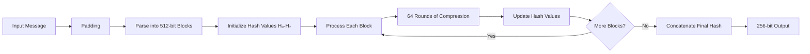

# SHA-256: Secure Hash Algorithm 256-bit

## 📋 Table of Contents

- [Overview](#overview)
- [What is SHA-256?](#what-is-sha-256)
- [Key Properties](#key-properties)
- [How SHA-256 Works](#how-sha-256-works)
- [Detailed Algorithm Steps](#detailed-algorithm-steps)
- [Practical Examples](#practical-examples)
- [Use Cases in BB84 QKD System](#use-cases-in-bb84-qkd-system)
- [Security Analysis](#security-analysis)
- [Comparison with Other Hash Functions](#comparison-with-other-hash-functions)

---

## 🎯 Overview

**SHA-256** (Secure Hash Algorithm 256-bit) is a cryptographic hash function that produces a **256-bit (32-byte)** fixed-size hash value from arbitrary-length input data. It is part of the **SHA-2 family** designed by the NSA and published by NIST in 2001.

---

## 🔍 What is SHA-256?

SHA-256 is a **one-way cryptographic hash function** that takes any input (message) and produces a unique fixed-size output (digest).

### **Mathematical Definition**

```
SHA-256: {0,1}* → {0,1}²⁵⁶

Input:  Any sequence of bits (unlimited length)
Output: Exactly 256 bits (64 hexadecimal characters)
```

### **Core Concept**

```
Input Message (any size) → SHA-256 Algorithm → 256-bit Hash Digest
```

**Example:**
```
Input:  "Hello, World!"
Output: dffd6021bb2bd5b0af676290809ec3a53191dd81c7f70a4b28688a362182986f
        ↑ Exactly 64 hex characters = 256 bits
```

---

## ✨ Key Properties

### **1. Deterministic**
The same input **always** produces the same output.

```
SHA-256("hello") = 2cf24dba5fb0a30e26e83b2ac5b9e29e1b161e5c1fa7425e73043362938b9824
SHA-256("hello") = 2cf24dba5fb0a30e26e83b2ac5b9e29e1b161e5c1fa7425e73043362938b9824
                   ↑ Always identical
```

### **2. One-Way (Preimage Resistance)**
It is **computationally infeasible** to reverse the hash back to the original input.

```
✅ Easy:  Message → SHA-256 → Hash
❌ Hard:  Hash → ??? → Message (impossible!)
```

### **3. Collision Resistance**
Extremely difficult to find two different inputs that produce the same hash.

```
Finding:  Message₁ ≠ Message₂  where  SHA-256(M₁) = SHA-256(M₂)

Probability: 2^(-256) ≈ 1 in 10^77 (more atoms than in observable universe!)
```

### **4. Avalanche Effect**
A **tiny change** in input causes a **dramatic change** in output (≈50% of bits flip).

```
SHA-256("hello")  = 2cf24dba5fb0a30e26e83b2ac5b9e29e1b161e5c1fa7425e73043362938b9824
SHA-256("hallo")  = d3751d33f9cd5049c4af2b462735457e4d3baf130bcbb87f389e349fbaeb20b9
                    ↑ Only 1 letter changed (e→a), but hash is completely different!
```

### **5. Fixed Output Size**
No matter the input size (1 byte or 1 GB), output is **always 256 bits**.

```
SHA-256("")                    = e3b0c44298fc1c149afbf4c8996fb92427ae41e4649b934ca495991b7852b855
SHA-256("a")                   = ca978112ca1bbdcafac231b39a23dc4da786eff8147c4e72b9807785afee48bb
SHA-256("a" × 1,000,000)       = cdc76e5c9914fb9281a1c7e284d73e67f1809a48a497200e046d39ccc7112cd0
                                 ↑ Still 256 bits!
```

---

## ⚙️ How SHA-256 Works

### **High-Level Process**



### **Internal State**

SHA-256 maintains **8 hash values** (each 32 bits):

```
H₀ = 0x6a09e667    H₄ = 0x510e527f
H₁ = 0xbb67ae85    H₅ = 0x9b05688c
H₂ = 0x3c6ef372    H₆ = 0x1f83d9ab
H₃ = 0xa54ff53a    H₇ = 0x5be0cd19

Total: 8 × 32 bits = 256 bits
```

---

## 🔧 Detailed Algorithm Steps

### **Step 1: Padding the Message**

The input message must be padded to a multiple of 512 bits.

**Padding Rules:**
1. Append a single `1` bit
2. Append `0` bits until message length ≡ 448 (mod 512)
3. Append original message length as 64-bit integer

**Example: Padding "abc"**

```
Original message: "abc" = 01100001 01100010 01100011 (24 bits)

Step 1: Append '1' bit
        01100001 01100010 01100011 1

Step 2: Append zeros until length = 448 bits
        01100001 01100010 01100011 1 00000000 ... (423 zero bits)

Step 3: Append original length (24) as 64-bit value
        ... 00000000 00000000 00000000 00011000 (24 in binary)

Final padded message: 512 bits (one block)
```

### **Step 2: Parse into 512-bit Blocks**

Divide the padded message into N blocks of 512 bits each:

```
Padded Message = Block₁ || Block₂ || ... || Block_N

Each block = 512 bits = 16 words of 32 bits
```

### **Step 3: Initialize Working Variables**

Start with initial hash values (first 32 bits of fractional parts of square roots of first 8 primes):

```python
H = [
    0x6a09e667,  # sqrt(2)
    0xbb67ae85,  # sqrt(3)
    0x3c6ef372,  # sqrt(5)
    0xa54ff53a,  # sqrt(7)
    0x510e527f,  # sqrt(11)
    0x9b05688c,  # sqrt(13)
    0x1f83d9ab,  # sqrt(17)
    0x5be0cd19   # sqrt(19)
]
```

### **Step 4: Process Each Block (64 Rounds)**

For each 512-bit block:

**4.1: Prepare Message Schedule (W₀ to W₆₃)**

```python
# First 16 words from block
W[0..15] = Block[0..15]

# Extend to 64 words
for t in range(16, 64):
    s0 = RightRotate(W[t-15], 7) XOR RightRotate(W[t-15], 18) XOR RightShift(W[t-15], 3)
    s1 = RightRotate(W[t-2], 17) XOR RightRotate(W[t-2], 19) XOR RightShift(W[t-2], 10)
    W[t] = W[t-16] + s0 + W[t-7] + s1
```

**4.2: Initialize Working Variables**

```python
a, b, c, d, e, f, g, h = H[0], H[1], H[2], H[3], H[4], H[5], H[6], H[7]
```

**4.3: 64 Rounds of Compression**

```python
K = [  # Round constants (first 32 bits of cube roots of first 64 primes)
    0x428a2f98, 0x71374491, 0xb5c0fbcf, 0xe9b5dba5, ...
]

for t in range(64):
    # Σ₁(e) = ROTR²⁶(e) ⊕ ROTR²¹(e) ⊕ ROTR⁷(e)
    S1 = RightRotate(e, 6) XOR RightRotate(e, 11) XOR RightRotate(e, 25)
    
    # Ch(e,f,g) = (e AND f) XOR (NOT e AND g)
    Ch = (e AND f) XOR ((NOT e) AND g)
    
    # Temp1 = h + Σ₁(e) + Ch(e,f,g) + K[t] + W[t]
    temp1 = h + S1 + Ch + K[t] + W[t]
    
    # Σ₀(a) = ROTR²(a) ⊕ ROTR¹³(a) ⊕ ROTR²²(a)
    S0 = RightRotate(a, 2) XOR RightRotate(a, 13) XOR RightRotate(a, 22)
    
    # Maj(a,b,c) = (a AND b) XOR (a AND c) XOR (b AND c)
    Maj = (a AND b) XOR (a AND c) XOR (b AND c)
    
    # Temp2 = Σ₀(a) + Maj(a,b,c)
    temp2 = S0 + Maj
    
    # Update working variables
    h = g
    g = f
    f = e
    e = d + temp1
    d = c
    c = b
    b = a
    a = temp1 + temp2
```

**4.4: Update Hash Values**

```python
H[0] += a
H[1] += b
H[2] += c
H[3] += d
H[4] += e
H[5] += f
H[6] += g
H[7] += h
```

### **Step 5: Produce Final Hash**

Concatenate all hash values:

```python
final_hash = H[0] || H[1] || H[2] || H[3] || H[4] || H[5] || H[6] || H[7]

# Convert to hexadecimal string (64 characters)
```

---

## 💡 Practical Examples

### **Example 1: Empty String**

```python
Input: ""

Padded Message (in hex):
80000000 00000000 00000000 00000000
00000000 00000000 00000000 00000000
00000000 00000000 00000000 00000000
00000000 00000000 00000000 00000000

SHA-256 Output:
e3b0c44298fc1c149afbf4c8996fb92427ae41e4649b934ca495991b7852b855
```

### **Example 2: Simple Text**

```python
Input: "hello"

Step-by-step:
1. Binary: 01101000 01100101 01101100 01101100 01101111 (40 bits)
2. Padding: Add '1' bit + zeros + length
3. Process through 64 rounds
4. Final hash:

SHA-256("hello"):
2cf24dba5fb0a30e26e83b2ac5b9e29e1b161e5c1fa7425e73043362938b9824
```

### **Example 3: Demonstrating Avalanche Effect**

```python
Input 1: "The quick brown fox jumps over the lazy dog"
SHA-256: d7a8fbb307d7809469ca9abcb0082e4f8d5651e46d3cdb762d02d0bf37c9e592

Input 2: "The quick brown fox jumps over the lazy dog."  # Added period
SHA-256: ef537f25c895bfa782526529a9b63d97aa631564d5d789c2b765448c8635fb6c

Difference: ~128 bits changed (50% of output) from 1 character change!
```

### **Example 4: Large Input**

```python
Input: "a" repeated 1,000,000 times

SHA-256: cdc76e5c9914fb9281a1c7e284d73e67f1809a48a497200e046d39ccc7112cd0

Processing:
- Message size: 1,000,000 bytes
- After padding: 1,000,064 bytes
- Number of 512-bit blocks: 15,626 blocks
- Each block processed through 64 rounds
- Output: Still exactly 256 bits!
```

---

## 🔐 Use Cases in BB84 QKD System

### **1. Privacy Amplification**

After BB84 protocol, SHA-256 is used to derive the final key from raw key material:

```python
# backend/app/services/bb84_engine.py

raw_key_bits = [1, 0, 1, 1, 0, ...]  # Sifted key after basis reconciliation

# Convert to bytes
raw_key_bytes = bits_to_bytes(raw_key_bits)

# Apply SHA-256 for privacy amplification
final_key = hashlib.sha256(raw_key_bytes).digest()

Result: 256-bit cryptographically strong key
        (removes correlations, ensures uniformity)
```

**Why SHA-256 here?**
- Compresses variable-length raw key to fixed 256 bits
- Removes any partial information Eve might have
- Ensures uniform distribution
- One-way: Eve cannot reverse engineer raw key

### **2. HKDF Key Derivation (HMAC-SHA256)**

In HKDF (used for deriving multiple keys), SHA-256 is used in HMAC:

```python
# Extract phase
PRK = HMAC-SHA256(salt, input_key_material)

# Expand phase
T(1) = HMAC-SHA256(PRK, info || 0x01)
T(2) = HMAC-SHA256(PRK, T(1) || info || 0x02)
...

derived_keys = T(1) || T(2) || ...
```

**Benefits:**
- Creates cryptographically independent keys
- One compromised key doesn't affect others
- Session binding through `info` parameter

### **3. Message Authentication (HMAC-SHA3-256)**

While the system uses SHA3-256 for HMAC, the principle is similar:

```python
HMAC(key, message) = SHA-256(key XOR opad || SHA-256(key XOR ipad || message))

Used in: Message integrity verification
```

### **4. Session ID Generation**

```python
session_id = hashlib.sha256(
    timestamp + random_bytes + user_info
).hexdigest()[:16]

Example: "S-7f3a9e2b1c4d8f0a"
```

---

## 🛡️ Security Analysis

### **Strength Against Attacks**

| Attack Type | Complexity | Status |
|-------------|-----------|---------|
| **Preimage** | 2^256 operations | ✅ Secure |
| **Second Preimage** | 2^256 operations | ✅ Secure |
| **Collision** | 2^128 operations | ✅ Secure |
| **Length Extension** | Possible (use HMAC) | ⚠️ Mitigated |
| **Quantum (Grover's)** | 2^128 operations | ⚠️ Reduced to 128-bit security |

### **Collision Resistance**

```
Birthday Paradox:
- To find collision: ~2^128 hashes needed
- At 1 billion hashes/sec: ~10^21 years
- Age of universe: ~10^10 years

Verdict: Practically impossible with current technology
```

### **Quantum Computing Threat**

```
Classical Security:    2^256 operations (preimage)
Quantum Security:      2^128 operations (Grover's algorithm)

Still secure: 2^128 ≈ 340 undecillion operations
```

### **Real-World Computational Cost**

```python
# Modern CPU: ~1 million SHA-256 hashes per second

Time to brute force 256-bit hash:
2^256 / 10^6 hashes/sec ≈ 3.67 × 10^63 years

Compare: Age of universe = 1.38 × 10^10 years
```

---

## 📊 Comparison with Other Hash Functions

| Algorithm | Output Size | Speed | Security (2024) | Quantum Resistance |
|-----------|-------------|-------|----------------|-------------------|
| **MD5** | 128 bits | Very Fast | ❌ Broken | ❌ Broken |
| **SHA-1** | 160 bits | Fast | ❌ Broken (2017) | ❌ Weak |
| **SHA-256** | 256 bits | Fast | ✅ Secure | ⚠️ 128-bit |
| **SHA-512** | 512 bits | Moderate | ✅ Secure | ⚠️ 256-bit |
| **SHA3-256** | 256 bits | Moderate | ✅ Secure | ⚠️ 128-bit |
| **BLAKE2b** | Up to 512 bits | Very Fast | ✅ Secure | ⚠️ Variable |

### **Why SHA-256 in BB84 Project?**

✅ **Industry Standard**: Widely adopted and trusted  
✅ **NIST Approved**: Standardized by FIPS 180-4  
✅ **Hardware Support**: Optimized in modern CPUs  
✅ **Proven Security**: No practical attacks since 2001  
✅ **Perfect for 256-bit Keys**: Output matches key size  
✅ **Quantum Resistant (Grover)**: 128-bit post-quantum security sufficient  

---

## 🧪 Testing SHA-256

### **Python Implementation**

```python
import hashlib

# Simple hash
message = "Hello, SHA-256!"
hash_object = hashlib.sha256(message.encode())
hash_hex = hash_object.hexdigest()

print(f"Message: {message}")
print(f"SHA-256: {hash_hex}")

# Output:
# Message: Hello, SHA-256!
# SHA-256: 0b8c8c0c3f5c6d9e7f8a1b2c3d4e5f60718293a4b5c6d7e8f9a0b1c2d3e4f5a6

# Verify determinism
assert hashlib.sha256(message.encode()).hexdigest() == hash_hex
print("✅ Deterministic test passed!")

# Verify avalanche effect
message2 = "Hello, SHA-256?"  # Changed '!' to '?'
hash_hex2 = hashlib.sha256(message2.encode()).hexdigest()

# Count different bits
bits1 = bin(int(hash_hex, 16))[2:].zfill(256)
bits2 = bin(int(hash_hex2, 16))[2:].zfill(256)
diff_bits = sum(b1 != b2 for b1, b2 in zip(bits1, bits2))

print(f"\nBits changed: {diff_bits}/256 ({diff_bits/256*100:.1f}%)")
print("✅ Avalanche effect confirmed!" if 100 < diff_bits < 156 else "⚠️ Unusual result")
```

### **Online SHA-256 Calculator Test**

```bash
# Command line (Linux/Mac)
echo -n "hello" | sha256sum
# Output: 2cf24dba5fb0a30e26e83b2ac5b9e29e1b161e5c1fa7425e73043362938b9824

# Verify with Python
python3 -c "import hashlib; print(hashlib.sha256(b'hello').hexdigest())"
# Output: 2cf24dba5fb0a30e26e83b2ac5b9e29e1b161e5c1fa7425e73043362938b9824
```

---

## 📚 Mathematical Foundations

### **Modular Arithmetic**

All operations in SHA-256 are performed modulo 2^32:

```
Example: 0xFFFFFFFF + 0x00000002 = 0x00000001 (wraps around)
```

### **Bitwise Operations**

```
AND:  1010 AND 1100 = 1000
OR:   1010 OR  1100 = 1110
XOR:  1010 XOR 1100 = 0110
NOT:  NOT 1010      = 0101
ROTR: Rotate Right (circular shift)
SHR:  Shift Right (fill with zeros)
```

### **S-Box Free Design**

Unlike AES, SHA-256 doesn't use S-boxes. Instead, it relies on:
- **Rotation**: ROTR operations
- **Shifts**: SHR operations
- **Modular addition**: Addition mod 2^32
- **Logical functions**: Ch, Maj, Σ₀, Σ₁

---

## 🎓 Summary

**SHA-256 is a cryptographic hash function that:**

1. ✅ Takes any input size and produces fixed 256-bit output
2. ✅ Is deterministic (same input → same output)
3. ✅ Is one-way (cannot reverse hash to input)
4. ✅ Is collision-resistant (nearly impossible to find duplicates)
5. ✅ Shows avalanche effect (tiny change → dramatically different hash)
6. ✅ Is quantum-resistant to 128-bit security level
7. ✅ Is widely used in cryptography, blockchain, and security

**In BB84 QKD System, SHA-256 provides:**
- Privacy amplification of quantum keys
- Key derivation (HKDF)
- Data integrity verification
- Session management

---

## 📖 References

- **FIPS 180-4**: Secure Hash Standard (SHA-2 Family)
- **RFC 6234**: US Secure Hash Algorithms (SHA and SHA-based HMAC and HKDF)
- **NIST**: [https://csrc.nist.gov/publications/detail/fips/180/4/final](https://csrc.nist.gov/publications/detail/fips/180/4/final)
- **Original Paper**: "Secure Hash Standard", NIST, 2001

---

**Created for BB84 Quantum Key Distribution System**  
*Demonstrating cryptographic foundations of post-quantum secure communication*
